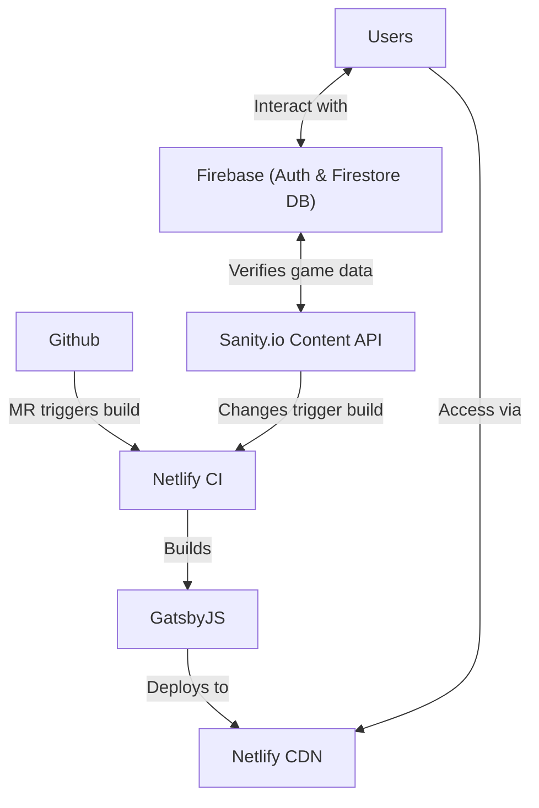

During the second Points' hackathon of 2021 I was involved in a project that aimed to build an application to gamify our on-boarding process with interactive activities and reinforced learning. It featured various quizzes that are added to certain pages, which are all configured via Sanity's content API. Players are awarded points for completing sections of content, and badges for each module they complete.

The modules' static content benefited from Gatsby's static builds, while being sourced from [Sanity.io](https://www.sanity.io/). The interactive elements being powered by Firebase; Firebase Auth to handle user authentication and Firestore to store the game and player data. We also made use of Firebase functions to act as our game back-end, verifying player submissions and issuing points and badges.

<details>
  <summary>Click here to reveal a diagram of the overly complicated setup</summary>
<figure>


</figure>
</details>

## Gatsby groundwork

Nothing too fancy with the Gatsby setup for this. We're using the new 
[Gatsby 4](https://www.gatsbyjs.com/gatsby-4), and the new reworked 
[`gatsby-plugin-image`](https://www.gatsbyjs.com/plugins/gatsby-plugin-image) that no longer needs your images to be sourced from GraphQL!

At first the plan was to have all our content stored as Markdown files in the `src` directory and then
build the game from that. Sourcing everything from the filesystem with 
[`gatsby-source-filesystem`](https://www.gatsbyjs.com/plugins/gatsby-source-filesystem) and then 
processing the Markdown with [`gatsby-plugin-mdx`](https://www.gatsbyjs.com/plugins/gatsby-plugin-mdx/). 

Shortly after starting we decided to try and integrate a headless CMS to replace the local content files. In the end we opted to try Sanity.io. This allowed
us to deploy content independently of the application code, which will open up the opportunity to 
make use of incremental builds from Gatsby 4, and has the added benefit of letting non-technical team members write content in a friendly CMS environment rather than having to learn markdown. 
You can read more on our [integration with Sanity.io](#sanityio) below.

## Using v9 of the Firebase JS SDK 

Firebase's new JavaScript SDK has changed quite a bit since I last used it. The new [v9](https://firebase.googleblog.com/2021/08/the-new-firebase-js-sdk-now-ga.html) uses JavaScript modules which makes the library tree-shakable!
It features a much nicer syntax than the previous version, and significantly reduces the bundle size as you're no longer dragging around the entire `firestore` SDK if you're only using a few parts!

```js
// New: v9 modular import
import { getFirestore } from "firebase/firestore";

/* ----- */

// Old: v8 global object
const firebase = require("firebase");
// Required for side-effects
require("firebase/firestore");
```

### Getting Firebase to work with Gatsby Build

To support Gatsby's static builds, we needed to ensure Firebase's client functionality is only called on the client, not during the build. You can do this by making use of a [React Context](https://reactjs.org/docs/context.html) to serve our Firebase objects, and initialise them correctly on the client all via a [useEffect](https://reactjs.org/docs/hooks-reference.html#useeffect) hook contained within the context. To do this you need three files which will do the following: 

- `src/firebase/setup.js` - houses our firebase config, initialises the app and exposes a `isDevelopment` utility flag.
- `src/firebase/FirebaseProvider.js` - our provider component passes our Firebase objects to components that are descendants of the provider.
- `src/firebase/FirebaseContext.js` - our React context we import in our page templates.

> We're also configuring some values for use with the [Firebase Emulators](https://firebase.google.com/docs/emulator-suite) which makes local Firebase development much easier.


### Firebase Context & Provider

First up we need to configure our firebase app like so:

```js:title=src/firebase/setup.js
import { initializeApp } from "firebase/app";

const config = {
  apiKey: "######################################",
  authDomain: "foo-bar.firebaseapp.com",
  projectId: "replace-with-your-firebase-credentials",
  storageBucket: "foo-bar.appspot.com",
  messagingSenderId: "###########",
  appId: "1:############:web:#####################",
  measurementId: "G-#########"
}

export const app = initializeApp(config);
export const isDevelopment = process.env.NODE_ENV === 'development';
```

Remember to replace the `config` object with your credentials from the Firebase admin. Next up is our provider, this file makes use of the hook to initialise the code on the client via a side effect.

```js:title=src/firebase/FirebaseProvider.js
import React, {useEffect, useState} from "react";
import {FirebaseContext} from "./FirebaseContext";
import {connectAuthEmulator, getAuth} from "firebase/auth";
import {connectFirestoreEmulator, getFirestore} from "firebase/firestore";
import {isDevelopment} from "./setup";

export const FirebaseProvider = ({ children }) => {
  const [user, setUser] = useState(null);
  const [firestore, setFirestore] = useState(null);

  const auth = getAuth();

  useEffect(() => {

    if(!auth) return;

    if(isDevelopment) {
      connectAuthEmulator(auth, "http://localhost:9099");
    }

    if(firestore === null) {
      let _db = getFirestore();
      if(isDevelopment) {
        connectFirestoreEmulator(_db, 'localhost', 8080)
      }
      setFirestore(_db);
    }

    return auth.onAuthStateChanged((firebaseUser) => {
      setUser(firebaseUser);
    });
  }, [auth, firestore]);

  const output = {
    user: user,
    db: firestore,
    auth: auth,
  }

  return <FirebaseContext.Provider value={output}>{children}</FirebaseContext.Provider>;
};
```

The provider's associated React context file is as follows. I am setting the context properties to `null`, so I can deconstruct without issue when the different fields haven't been initialised on the client, like during a build.

```js:title=src/firebase/FirebaseContext.js
import React from "react";

export const FirebaseContext = React.createContext({
  user: null,
  db: null,
  auth: null,
});
```

### Using our new context

With our context and provider all setup, we're ready to make use of Firebase in our app. I can make Firebase calls on the pages using this context in a `useEffect()` or equivalent react hook. For example, I can make a Firestore query to get a particular document or result of a query:

```js:title=src/pages/example.jsx
import React, { useContext, useEffect, useState } from "react";
import { FirebaseContext } from "../firebase/FirebaseContext";

const ExamplePage = () => {
  const { db, user } = useContext(FirebaseContext);
  const [leaderboard, setLeaderboard] = useState([]);
  
  useEffect(() => {
    let unsubscribe;

    // Wrap our Firebase call in an Async function so we can use `await` if we want.
    async function fetchData() {
      const collectionRef = collection(db, "players");
      const q = query(collectionRef, orderBy("points", "desc"), limit(5));
      return onSnapshot(q, (querySnapshot) => {
        const results = [];
        querySnapshot.forEach((result) => {
          results.push(result.data());
        });
        setLeaderboard(results);
      });
    }

    if (!user) return;
    if (!db) return;
    fetchData().then((unsub, results) => {
      unsubscribe = unsub;
      setLeaderboard(results);
    });

    return () => {
      unsubscribe();
    };
  }, [user, db]);
  
  return (
    <pre>{ JSON.stringify(leaderboard, null, 2) }</pre>
  )

}

export default ExamplePage;
```

## Sanity.IO

It sometimes feels I am in a never ending search for a headless CMS that isn't too complex for non-technical users to use. There are other great content API platforms like Prismic, and Contentful, but I find their editing interfaces far too complex for anything other than basic usage.

One promising candidate is Sanity, which I came across during [Jamstack conf](https://jamstackconf.com/). Their API docs take a bit of getting used to, I find them a little over-designed but their product is excellent. It also comes with a great product called [Sanity Studio](https://www.sanity.io/studio), which is a customisable editor app that you deploy alongside their managed service.

Part of Sanity's offering is a GraphQL API that we can hook up as a data source to Gatsby using their easy-to-use Gatsby plugin: [gatsby-source-sanity](https://www.gatsbyjs.com/plugins/gatsby-source-sanity/), with just a little config you are up and running:

```js:title=gatsby-config.js
{
  resolve: `gatsby-source-sanity`,
  options: {
    projectId: `#######`,
    dataset: `#########`,
    // a token with read permissions is required
    // if you have a private dataset
    token: process.env.SANITY_TOKEN,
    watch: true,
    // If the Sanity GraphQL API was deployed using `--tag <name>`,
    // use `graphqlTag` to specify the tag name. Defaults to `default`.
    graphqlTag: 'default',
  },
},
```

### Making pages with Sanity content

Now we have access to our Sanity "Data Lake" via Gatsby's GraphQL, from here we can use the [`createPages`](https://www.gatsbyjs.com/docs/reference/config-files/gatsby-node#createPages) lifecycle hook to create pages from the content from Sanity; just like you would for any other data sourced page creation. For example, you can see how I'm doing it for this site on [GitHub](https://github.com/jamesrwilliams/personal-site/blob/master/gatsby-node.js#L17-L40) but here is a summary for reference:

```js:title=gatsby-node.js
exports.createPages = async ({ actions, graphql }) => {
  const { createPage } = actions;
  // Replace this query with a Sanity one...
  const { data } = await graphql(`
    {
      pages: allSanityPages {
        nodes {
          _id
          title
          slug
        }
      }
    }
  `);

  data.pages.nodes.forEach((page) => {
    createPage({
      path: `/page/${page.slug}`,
      component: require.resolve('./src/components/layouts/pageLayout.tsx'),
      context: {
        ...page,
      },
    });
  });
```

We can then query using `pageContext` in the `BlogPostTemplate.tsx` template to grab the individual page
content. This is more effective than querying for all page props in `gatsby-node.js` and then passing 
them via context. You can read more about why this is in their docs: 
["Trade-offs of querying for all fields in the context object of gatsby-node.js"](https://www.gatsbyjs.com/docs/creating-and-modifying-pages/#trade-offs-of-querying-for-all-fields-in-the-context-object-of-gatsby-nodejs)

### Firebase Cloud Functions access Sanity 

Back to our original project, we're using Firestore to manage our player data and keeping our content and game configuration in Sanity. The next part of the puzzle is to create a back-end service to validate answers and issue players points and badges.

Firebase Cloud Functions are a great solution for this, easy to develop for, test (with the emulators), deploy and manage. They do require you to upgrade your Firebase's project to a paid plan, but that still includes the generous free tier of 2M calls per month at the time of writing. For this approach to work will need two things: 
1. A method for fetching data from Sanity's DB, 
2. A way to validate which users are calling the function.

### Use GROQ to query Sanity over REST 

To query Sanity from the Firebase function we opted for a REST call as it seemed like the easier option. We can query Sanity over REST using a query syntax called ["Graph-Relational Object Queries"](https://www.sanity.io/docs/groq) or GROQ. It's syntax looks like this:

```js
*[_type == 'movie' && releaseYear >= 1979] 
```

First step in making this call is to URL encode our query, then make a `GET` request to our Sanity query endpoint (which you can find details for [here](https://www.sanity.io/docs/http-query)) and then make a request to retrieve the data.

```js
const SANITY_DB_URL = `https://###.apicdn.sanity.io/v1/data/query/####?query=`
const query = encodeURIComponent(`*[_type == 'movie' && releaseYear >= 1979]`)
const query_url = `${SANITY_DB_URL}${query}`;
const { ms, query, result } = await axios.get(query_url).catch((error) => console.log(error));
```

### Using tokens to validate calls

We now have our answers from Sanity, all that is left is to make sure we've got a legitimate player and to find their `uid`. We're using for Player IDs as player DB keys in Firestore. For this we need to identify the currently signed-in user to correctly allocate their 
results and points to the user in the DB if their attempt at the quiz is correct. To do this we need
to verify ID tokens.

> Many other use cases for verifying ID tokens on the server can be accomplished by using Firestore Security Rules, but this isn't really one of them.

To get started, prior to calling our back-end function, we need to generate a token for our current 
user on the client application. We can do this by doing the following:

```js
// Auth here corrasponds to our context and ultimately the { getAuth } from "firebase/auth";
const token = await auth.currentUser.getIdToken(true);
```

We can then pass the `token` to our function via a header or the body and then validate in the function
that the user is legitimate and parse for a `UID` from the caller.

```js:title=functions/index.js
const { uid } = await admin.auth().verifyIdToken(idToken);
```

## In Summary

I really do have the habit of over-engineering things but, I thought this hackathon project was a perfect opportunity to use all these
services and technologies together and see what I could learn, and learn I did. 

Once you get past some challenges with static builds and understand the lifecycle of what Firebase is trying to behind the scenes you're away! Certainly inspired to try more of my random app ideas now I know I can use these technologies together! I also think I've found my headless CMS of choice! Sanity and Sanity Studio are solid products, and I will be using them again in the future. 

Oh, and we didn't win the hackathon in the end, no one even signed up for our working demo!
