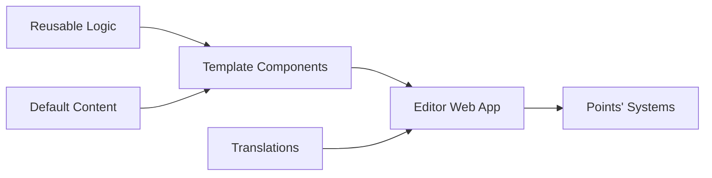

With my move to the engineering team at [Points](https://www.points.com), I've had to step away from one of my most recent random idea for workflow improvement: An interactive GUI to edit props that are passed to React components.

It is a bit like [Storybook](https://storybook.js.org/), but tailored to Points' needs, creating the compiled HTML/CSS/JS assets right in the browser. If you're asking why on earth would you ever need something like that, let me explain myself, and my over&#8209;engineered solution.

## Some context

In my previous role I was responsible for creating small marketing HTML/CSS/JS things we called "banners". These banners are added to our system console to customise our Partner's storefronts as part of a marketing campaign, such as a call out to a 25% discount promotion.

When I first joined the team back in 2019, these banners where manually created by writing code directly into our product console. A few weeks into the job I started writing a NodeJS CLI to automate some heavy lifting and making the developer experience less cumbersome. The CLI handled things like file concatenation, css-preprocessor support, some business rule validation, and ES6 transpiling down to our supported browser list. Think webpack but homemade?

The CLI could also bootstrap new banner projects with starting files and then generate the output we needed to add to our product console. Producing cleaner, more maintainable code in a snap. 

There was one pain-point the CLI didn't solve for us, variations. Variations are our way to describe the different versions of a banner that might be part of a single campaign. There are three categories of variations typically:

- **Editorial** - These are content and design differences to support things like A/B tests, or member targeting (based on things like tier status or balance).

- **Language** - Lots of our partner storefronts are available in more than one language, so all banner text needs to be translated.

- **Product** - Our various product types also need different content wording to support their product flows in some instances, (i.e. Buy vs Gift of loyalty currency).

Things can get out of hand very quickly when the number of deliverables depends on how many of each of these things we're working with: 

`Number of deliverables` = `editoral variations` &times; `languages` &times; `products`

The first version of the CLI handed editorial variations by sharing CSS/JS assets between HTML files, so we could create new HTML files for each variation. This worked, but not exactly the scalable solution we wanted, especially when things got multi-lingual.

The next version of the CLI moved to using CSV files (instead of JSON) for translations, these are much easier to transpile from the original <abbr title="Microsoft Excel">.XLS</abbr> source files we are provided. However, this still required creating a new CSV file, downloading it, and running the CLI to generate a new banner. Either way our CLI wasn't keeping up with the complexities of what we needed it to do, and we needed to rethink our approach.

## A solution

Instead of building bespoke banners for each campaign, we could make all these marketing banners editable. Not just by me or a member of the development team, but by anyone at the company through a web app. Instead of the usual request tickets being required to do the simplest change or update, now anyone at the company to generate branded templates and copy updates on the fly!
 
To do this we needed to decouple the banner content from its design and implementation. Most of our partners have their standard style that we tend to reuse, our new approach would now be to build a set of templates for each partner branded as per their requirements. These templates are just React components, with the content exposed as props so that our UI can edit these props dynamically!

With that idea, the "mainspring" editor was born and at a high level works like this:


<figure>
<figcaption>Flowchart showing the rough outline of the application</figcaption>
</figure>

## Templates

Instead of us using our Node CLI we now build everything as React components inside the `mainspring` project. All banners are now JSX templates, and each editable/translatable token is now a prop. For complex CSS we use [styled-components](https://styled-components.com/), this makes migration from our previous LESS styles a breeze as it supports rule nesting, and it's a better developer experience than inlining all the rules. Each template can be encapsulated in a single JSX file and is language agnostic so can be reused over and over!

To continue my focus on developer experience, I wrote a base component to do most of the setup, abstracting the code required in each template into a simple `<Wrapper />` component. This acts as our default starting block to contain the rest of the template and handles script inclusion! All through a what I think is a very clean syntax:

```jsx
import React from 'react';
import { Wrapper } from '../../../../library/';

const ExampleTemplate = () => (
  <Wrapper {...props}>
    { /* Rest of the template markup goes here */ }
  </Wrapper>
)

export default ExampleTemplate;
```

## Reusable Logic

For a few banner features we tend to repeat chunks of logic across a number of banner files. Things like count-down clocks, that count down to the end of a special offer, or a "best offer" tier selector buttons all have a standard chunk of Javascript we used to copy-and-paste between projects, now they are encapsulated in a special library and can be imported using our `<Wrapper />` component.

Example of adding a countdown clock to a template using our countdown script from the library, we import the `countdown` script from the Library and add it to the scripts prop on the `<Wrapper />` component:

```jsx
import React from "react";
import { Wrapper, countdown } from '../../../../library/';

const BaseTemplate = (props) => (
    <Wrapper scripts={[countdown]} {...props}>
      { /* Add Markup required by countdown here */ }
    </Wrapper>
);
```

## The editor

The editor features an inline preview window to see the template you're editing, a spreadsheet editor used for working with the translated content. With languages along the X axis and the various tokens on the Y axis.

Once the banner is ready to go the editor can export the code for use in our admin console. Not only is this fast, allows us to quickly customise things on the go, it also reduces code size by obfuscating into smaller variable names. We use [`ReactDOMServer.renderToStaticMarkup`](https://reactjs.org/docs/react-dom-server.html#rendertostaticmarkup) to generate the output code.

<figure>


<figcaption>A screenshot of the mainspring editor editing a banner</figcaption>
</figure>


You can also add some custom CSS and JS in the editor for all the banner languages, which also allows some small tweaks to be made in the editor that doesn't require a code changes to the banner template.

I also added support for personalisation directly into the editor, using `%` syntax around state variables, you can insert values dynamically into your translated content!
You could add `Hi %firstName%` as a token, and it would replace the variable with the member's first name when the banner loads on a storefront!

## It probably shouldn't, but it works

At the time I changed roles this wasn't being used to generate assets for production just yet. I think I used it once for a quick test in production at some point, and it worked perfectly! It does need thorough testing before it gets adopted fully but as a concept, it works!
 
It does exactly what I wanted it to, and seems to alleviate the issues I set out wanting to solve. If the team continues to use it remains to be seen, but through its ugliness, I'm very proud of it.
