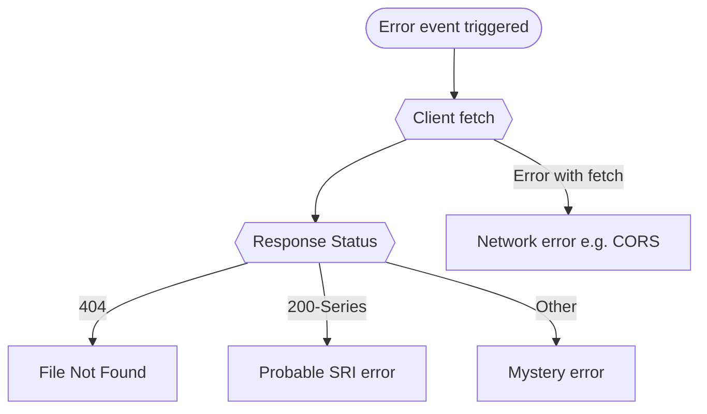

One of the more recent web security topics I have been working with is subresource integrity or SRI.
These take the form of hashes set as the `integrity` on various assets which help mitigate against file manipulation attacks by providing a way for a browser to verify a files' integrity when fetched over the internet, like from a CDN.

At Points, one of the biggest challenges with implementing SRI for our systems was monitoring SRI errors. We needed a way to monitor issues where our integrity hashes no longer matched. This sadly was occurring frequently, caused by intricacies with our implementations and infrastructure involving a lot of aggressive caching coupled with a multi-faceted client app.

## What is Subresource Integrity (SRI)

Before we get much further I'd like to explain in more detail what SRI is. To quote directly from the [MDN's article](https://developer.mozilla.org/en-US/docs/Web/Security/Subresource_Integrity) on Subresource Integrity: 

> SRI is a security feature that enables browsers to verify that resources they fetch (for example, from a CDN) are delivered without unexpected manipulation. It works by allowing you to provide a cryptographic hash that a fetched resource must match.

For example, take the following stylesheet link that can be used to add [Bootstrap 4](https://getbootstrap.com/docs/4.3/getting-started/introduction/) to a webpage:

```html{5} {numberLines: 1}
<link
  rel="stylesheet"
  href="https://stackpath.bootstrapcdn.com/bootstrap/4.3.1/css/bootstrap.min.css"
  crossorigin="anonymous"
  integrity="sha384-ggOyR0iXCbMQv3Xipma34MD+dH/1fQ784/j6cY/iJTQUOhcWr7x9JvoRxT2MZw1T"
/>
```

This `intergity` property is a base64 encoded `sha384` hash digest of file's contents. When the browser fetches the file, it will verify the hash provided in the `integrity` property matches what it downloaded. If it matches, the file will load and be processed as normal.

This feature is particularly useful when you want to ensure files trusted by your content-security-policy haven't changed. A downside is it works very well, as soon as a file's hash isn't correct the file will throw an error, but not a normal error. If the hash doesn't match, the browser will refuse to execute the file _"and must instead return a network error indicating that fetching of that script or stylesheet failed."_, which is where our problems start.

## The problem

When these hashes are incorrect we get error shown below. On the surface it looks normal but this one is not accessible through traditional listeners as it is considered a "network error".

<figure>


<figcaption>
The Firefox message for an invalid hash (top) and the more helpful one from Chrome's (bottom) message.
</figcaption>
</figure>

Our plan was to log these errors to [Sentry](https://sentry.io/welcome/) for visibility and alerting using their JS SDK. But
without access to an event we're not going to be able to do anything let alone use 
Sentry. Our first problem to solve is to somehow listen for these error events.

## The merry goose chase

Before the benefit of hindsight, Our first guess was these might be window error events of some kind, and a `window.onerror` listener would catch them. Nope. Nothing gets logged:

```js
window.onError = evt => {
    console.log({evt}); // <-- Doesn't get fired on SRI error
}
```

Our next plan was to use a `MutationObserver`. The [MutationObserver](https://developer.mozilla.org/en-US/docs/Web/API/MutationObserver) interface provides the ability to watch for changes being made to the DOM tree. This was not something I wanted to use but thought I'd try it. Here is a rough example logging every mutation detected on the `document`.

```js
/**
 * This sets up a MutationObserver on the document 
 * to see if we can see the SRI invalidation changing
 * @link https://developer.mozilla.org/en-US/docs/Web/API/MutationObserver
 */
new MutationObserver((mutations) => {

    console.groupCollapsed('Mutations')
    mutations.forEach(mutation => {
        console.log(mutation)
    });
    console.groupEnd()

}).observe(document, {
    childList: true,
    attributes: true,
    characterData: true,
    subtree: true,
    attributeOldValue: true,
});
```

If you filter past the myriad of Mutation events for the script/link ones that could signal an SRI issue you find there are no properties or events emitted for these errors. 

I was feeling defeated and my last, rather horrid idea, was to try using visual regression testing. Our specific use case was looking at CSS files and a core JS file, if these files failed to load it had a _very_ visible effect on the page. But before I did that I threw the ticket back to my team if they had any ideas. 

## Our solution

After floating this problem past a few team members we discovered I had overlooked a very simple, ugly, yet workable solution to monitoring these issues which was to use the [`onerror`](https://developer.mozilla.org/en-US/docs/Web/API/GlobalEventHandlers/onerror) property for the elements we want to check.

It is a little more hands-on approach than we would have liked but that this point anything on the client that can listen to these errors works for us! Our solution turned out to be adding a JS function to the window object and then adding it as the onerror event handler for each DOM node we want to monitor for SRI issues.

```html
<!-- Exposes the window.captureElmError function -->
<script src="captureSriErrors.js"></script>

<script
  type="text/javascript"
  src="app.js"
  integrity="sha-256-[...]"
  onerror="captureElmError(this)"></script>
```

One big problem with this solution is that you can't tell specifically if it was an SRI block that caused the error. There is no specific property I can find that can confirm this is indeed an SRI issue, time for some deductive reasoning.

Through some rough, process of elimination, we can attempt to find out what errors are actually SRI errors. Our process starts with trying a client-side fetch, if that is successful, it is a strong indicator that it is an SRI issue as the `fetch` doesn't have an integrity check and the file was returned correctly. It fails with a 404 the file can't be found, so we can rule that out and the `Fetch` will fail if we encounter any network issues, like hitting CORS. So what that looks like:

<figure>


<figcaption>

Idea for how to filter out other events that could trigger the `onerror` event.

</figcaption>
</figure>

## Example solution

Below is a simplified version of the monitor script: `captureSriErrors.js`, for this example we're simply logging the type of error we think this is. In our apps we have this rigged to our error logging system.

```js
/**
 * For use with a script or link element as the onerror handler.
 * This script will attempt to work out if a script error was caused by an integrity mismatch or not
 *
 * @param {HTMLElement} elm
 * @returns {Promise<void>}
 */
window.capturePotentialSriError = async (elm) => {
    
  const ELM_MAP = {
    'SCRIPT': 'src',
    'LINK': 'href',
  }

  const checkStatus = async (url) => {
    try {
      const result = await fetch(url);
      // IF the get returns a 404 its not an SRI issue
      if(result.status === 404) return 'NOT_FOUND';
      // If the node errored and then returned a 200 on the fetch. It looks likely for an SRI issue.
      return 'SRI_INTEGRITY';
    } catch (error) {
      // The fetch will error on other security issues like CORS.
      return 'OTHER_SECURITY';
    }
  }

  const requestUrl = elm[ELM_MAP[elm.nodeName]];
  const result = await checkStatus(requestUrl);

  switch (result) {
    case "OTHER_SECURITY":
      console.log('SECURITY ISSUE with url: ', requestUrl);
      break;
    case "SRI_INTEGRITY":
      console.log('SRI issue with url: ', requestUrl);
      break;
    case "NOT_FOUND":
      console.log('404 for: ', requestUrl);
      break;
    default:
      console.log('OTHER ERROR', requestUrl);
      break;
  }
}

```

## Summary

Like anything security this can be fiddly and have surprise consequences for your workflow but with the right tooling SRI is a great security add on for any assets you load over a CDN. If you need to automatically monitor/log these errors take a look at my work-in-progress JS library to make that easier based on the research for this post: [subresource-integrity-error-detection
](https://github.com/jamesrwilliams/subresource-integrity-error-detection).

## See also

- [Peter Major's post on subresource-integrity](https://aldaris.github.io/dev/security/2018/03/05/subresource-integrity.html)
- [Handling load error within subresource integrity check](https://stackoverflow.com/questions/40408636/handling-load-error-within-subresource-integrity-check#answer-54147581)
- [cyph/sri-fallback](https://github.com/cyph/sri-fallback/blob/master/sri-fallback.js)
- [My question on StackOverflow about on this topic](https://stackoverflow.com/questions/69320904/is-it-possible-to-log-client-side-sub-resource-integrity-errors-with-javascript)
