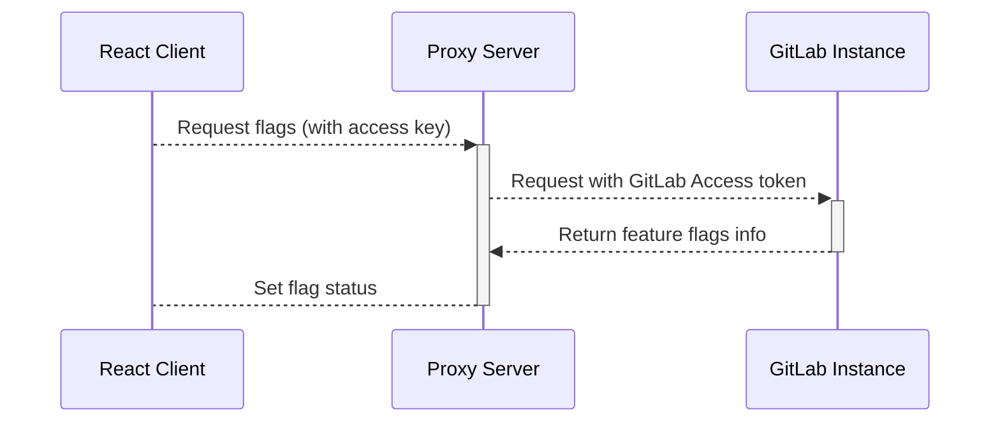

I've been taking a deeper look at GitLab's full DevOps platform and their feature
toggle offering caught my eye. This tool lets you configure and manage feature toggles
directly from the GitLab UI. In the past I have looked at services
like [LaunchDarkly](https://launchdarkly.com/) or Firebase's A/B testing offering for feature
toggles, I even tried my hand at building my
own [WordPress plugin](./feature-flags-wordpress-plugin) back in 2018. But the thing that
interests me most about GitLab offering is a combination of both configuration
that doesn't need a deployment to take effect, and also the proximity of the flags' configuration
to the development activities rather than another app.

## What is a feature toggle?

At its most basic form a feature toggle is a boolean that tells an application to do one thing or
another based on its value:

```js
if(is_my_feature_enabled) {
  doTheThing();
} else {
  doTheOtherThing();
}
```

When you third party most providers this boolean variable becomes a function call to an SDK. For
example this is how you check a feature flag with LaunchDarkly's JS SDK:

```ts
// Skipping the LaunchDarkly SDK setup for `LDClient`
const flagValue = myLaunchDarklyClient.variation('YOUR_FEATURE_KEY', false);
```

The above checks with the vendor to see if `YOUR_FEATURE_KEY` is enabled for the current user and
will resolve to either `true` or `false` when this line of code is executed. An important note
is that feature toggles are typically run-time and not build time. This allows you to
toggle behavior without redeploying an application, or enabling a feature for a small subset
of users at a time, what is known as an _activation strategy_, which we will look at once our
React app is connected.

## Working with GitLab

Behind the scenes GitLab uses [Unleash](https://www.getunleash.io) which is an open source
feature management solution, but how to we use GitLab's feature toggles in a React app? There
are three components we need to
work on, these are:

1. _A GitLab project_ - Where we're going to manage our feature flags
2. _A Proxy server_ - A secure way to communicate with our GitLab instance from the client
3. _A React app_ - Make changes to our React app to use these toggles

Our React app doesn't communicate directly with the GitLab API, instead, we offer a dedicated
proxy service secured by an authorisation secret to read the status of our feature flags. The
React app then talks to the proxy that in tern communicates with our GitLab instance. Up first
setting up our GitLab project...

### Setting up our GitLab Project Feature toggles in the UI

We're assuming you already have a GitLab repository/project (possibly home to your React app)
that you want to use feature toggles with. If not you
can [register for a _free_ account](https://gitlab.com/users/sign_up/) or checkout
their [pricing page](https://about.gitlab.com/pricing/#gitlab-com). Once logged in to GitLab and
while viewing your project (assuming you have the right permissions), under "Deployments" you
should see an option titled _Feature Flags_.


If you have access you should be presented with a page that looks like this:

<figure>

  

  <figcaption>The empty feature flags page in GitLab</figcaption>
</figure>

Our first stop is to click on the _Configure_ button in the top right to open the
_Configure feature flags_ dialog:


We don't need to do anything other than save both the `API URL` and `Instance ID` values as we
will need these in a moment when we configure our proxy. One last bit of preparation work will
be to create a GitLab Access token.

### GitLab Access Token

This token will be used by the proxy service to communicate with your GitLab instance on your
behalf. For this I'd recommend you create
a [project access token](https://docs.gitlab.com/ee/user/project/settings/project_access_tokens.html#project-access-tokens)
instead of using a personal one, to restrict it to the project you're working with. Save your
token somewhere safe we will need it in a moment.

## The proxy server

Now we have our `API Token` (your Gitlab Access token), our `Instance ID` and our `API URL` we're
ready to configure our proxy service. The proxy application sits between GitLab and our React
app (the client), this structure provides some security and performance benefits as it doesn't
expose direct access to GitLab ensuring the internal feature toggle configuration isn't exposed
to the world!

Unleash does offer a free tier "hosted" option instead of having to run your own proxy which you
can find details about on their [pricing page](https://www.getunleash.io/plans) which also
allows you to skip the need for Gitlab too if you want.

<figure>



<figcaption>An overview of the Client => Proxy => Gitlab set up</figcaption>
</figure>

For this example we're going to use the Docker image Unleash provides and run the proxy locally.
We can use the following docker run command to pass the required environment variables to the
container.

```bash{numberLines: 1}
docker run -d \
  -e UNLEASH_PROXY_SECRETS="RANDOM_STRING_9vZBzCd2jeqE7JY" \
  -e UNLEASH_URL="https://gitlab.com/api/v4/feature_flags/..." \
  -e UNLEASH_INSTANCE_ID="XXXXXXXXXXXXXXXXXXXX" \
  -e UNLEASH_API_TOKEN=${GITLAB_PROJECT_ACCESS_TOKEN} \
  -p 3000:3000 \
  unleashorg/unleash-proxy
```

_Wait where did these values come from?_ Let's recap what each of these variables is doing and
where we got their values:

- `UNLEASH_PROXY_SECRETS` - This is a randomly chosen secret is used in both the client and proxy,
and is used to authorize calls to the proxy from the client app. This can be a comma separated
list of secrets but in this example we're passing a single string `RANDOM_STRING_9vZBzCd2jeqE7JY`.
_Please use a sensible secret in production!_
- `UNLEASH_URL` - This is our API URL from the GitLab configuration dialog.
- `UNLEASH_INSTANCE_ID` - This is the `Instnce ID` from the same configuration dialog.
- `UNLEASH_API_TOKEN` - This is our GitLab project access token (in this example I am passing in
an exported variable `GITLAB_PROJECT_ACCESS_TOKEN` to the `Docker` run command.)

Only the `UNLEASH_PROXY_SECRETS` value is shared with the client app and you can find a more
detailed breakdown of the configuration details, their defaults and what they're used for on
the [Unleash proxy configuration documentation](https://docs.getunleash.io/sdks/unleash-proxy#configuration).

Once the container is running you can cURL the service to verify its connected successfully:

```bash
curl -H "Content-Type: application/json" \
     -H "Authorization: [One of your UNLEASH_PROXY_SECRETS values]" \
     -X GET \
     http://localhost:3000/proxy
```

If the proxy is working you can expect something like the following as a JSON response:

```json
{
  "toggles": []
}
```

## Connect the client to the proxy

Now we've got the proxy setup and have verified its connected, time for the React app.
We're going to use [Create React App](https://create-react-app.dev/docs/getting-started) and the
official [Unleash React client](https://docs.getunleash.io/sdks/proxy-react) for this, which we
can install by running the following in our (assumed to be already set up) React project:

```shell
npm install @unleash/proxy-client-react
```

With the client installed we can now adjust the app root to add
our [context provider](https://reactjs.org/docs/context.html#contextprovider). With the Unleash
client we pass a `config` property, allowing it can connect to the proxy and ultimately out
GitLab instance. The following snippet shows how we're doing this using environment variables.
We're using [create-react-app](https://create-react-app.dev/docs/adding-custom-environment-variables/) in the following example it will pull our
values from our `.env` file in the project's root directory.

```jsx:title=src/index.jsx
import { FlagProvider } from '@unleash/proxy-client-react';

// Pull our config variables from our .env file
const {
  REACT_APP_PROXY_URL,
  REACT_APP_PROXY_CLIENT_KEY,
  REACT_APP_PROXY_APP_NAME,
  REACT_APP_PROXY_ENVIRONMENT
} = process.env;

// Set your config
const config = {
  url: REACT_APP_PROXY_URL,
  clientKey: REACT_APP_PROXY_CLIENT_KEY,
  appName: REACT_APP_PROXY_APP_NAME,
  environment: REACT_APP_PROXY_ENVIRONMENT,
  refreshInterval: 300, // How often (in seconds) the client should poll thef proxy for updates.
};
// [...]

// In your root renderer:
root.render(
  <React.StrictMode>
    <FlagProvider config={config}>
      <App />
    </FlagProvider>
  </React.StrictMode>
);
```

You can find out more about the configuration options in the `@unleash/proxy-client-react`
library in the
[React SDK Initialization](https://docs.getunleash.io/sdks/proxy-react#initialization) docs.

Now we have the provider configured we can start making use of the feature toggles inside our
application's components. Here is a simple example that returns a paragraph tag with either the
word "Enabled" or "Disabled" depending on the state of the toggle.

```js:title=src/components/ExampleComponent.jsx
import { useFlag } from "@unleash/proxy-client-react";

export const ExampleComponent = () => {
  const exampleFlag = useFlag(`example_flag_key`);
  return <p>{ exampleFlag ? 'Enabled' : 'Disabled' }</p>
}
```

Running this you will see that `example_flag_key` is `false`. Which is correct as we have not
enabled a flag with that name, moreover we don't even have a flag with that name. The `useFlag`
function will always return `false` if a flag is known and disabled, or unknown. To get this
component to show "Enabled" we'll need to create, and activate the toggle.

## Adding a feature toggle

Let's add our flag and activate it to see this component go from "Disabled" to "Enabled". Let us
head back to Gitlab and to you project's "Feature Flags" dashboard (via `Deployments` / `Feature Flags` ) use the button
in the top right labeled "New Feature flag", where you should be presented with a screen like this:


For the `Name` add `example_flag_key` or if you changed it add your flag's name. You will have to
ensure is a valid "slug" format, the name can contain lowercase letters, digits, "\_" and "-".
Once you've added the name lets skip over the rest of the config and press "Create feature flag".


Once you create your flag you should be sent back to the list of flags with your new feature
toggle set to active by default. Now you can go back to your React app and once the
`refreshInterval` triggers a new fetch, the SDK should show your new flag as 'Enabled'!

## Activation strategies

Now we already know how to activate toggles for the app as a whole in the Gitlab admin. A more
powerful feature of GitLab/Unleash comes in the form of activating features for specific users
or enable it for a small group of users. Unleash call these "activation strategies" and offers four
different ways to activate feature toggles these include:

- `Standard` - Active for everyone
- `UserIDs` - Active for users with a userId defined in the userIds list
- `IPs` - The remote address strategy activates a feature toggle for remote addresses defined in
the IP list.
- `Hostnames` - The application hostname strategy activates a feature toggle for client instances
with a hostName in the hostNames list.

Unleash does a much better job of detailing your options when it comes to activation strategies,
I'd recommend checking out
their [Activation Strategies](https://docs.getunleash.io/user_guide/activation_strategy) page.

## An example using the `UserId` activation strategy

One of the activation strategies is using `UserIDs`. In the Gitlab UI we can target a specific
toggle to activate for specific values by configuring a User List and adding our `newUserId`
user ID to it. In the following example we're updating the SDK to set the current userId to a
custom value which is included in our User List and once complete the toggle will activate.

```jsx:title=UserIdActivationStrategy.jsx
import { useUnleashContext } from "@unleash/proxy-client-react";
import { ExampleComponent } from "../components/ExampleComponent.jsx"

export const UserActivation = () => {

  const updateContext = useUnleashContext();

  const setUserId = async (newUserIdValue) => {
    console.log(`Set userId to ${newUserIdValue}`);
    return updateContext({userId: newUserIdValue});
  }

  return (
    <div>
      <h1>Flag status for user: <ExampleComponent /></h1>
      <button onClick={() => setUserId('newUserId')}>Set</button>
    </div>
  )
}

```

Be sure to check out
the [Activation Strategies](https://docs.getunleash.io/user_guide/activation_strategy) page on the
Unleash documentation along
with [GitLab's own docs](https://docs.gitlab.com/ee/operations/feature_flags.html) for its feature
toggle offering and the activation strategy that are supported out of the box.

With that we've now set up a React app to use a Gitlab feature flags!

