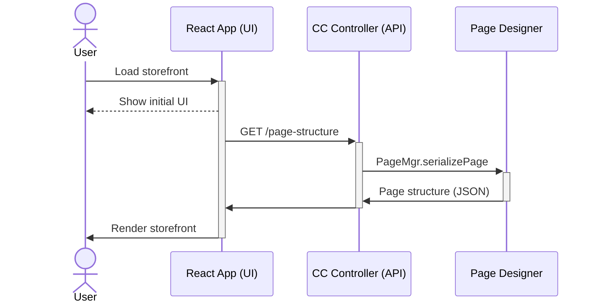

I've recently been involved in some projects that involves using
[Salesforce Commerce Cloud](https://www.salesforce.com/products/commerce-cloud/overview/) (SFCC), a
powerful enterprise e-commerce solution akin to Shopify but firmly focused on enterprise (and it 
shows). To reduce training overhead we looked to apply the "headless" approach allowing our 
front-end team to not need to re-train on SFCC specific technologies. We provide an API contract 
and they are away. 

Our goal was to build a React front-end that makes use of as much of the commerce cloud platform as
possible. We looked to apply the "headless" approach where we use SFCC as our API and our front-end
consumes them. The headless approach isn't something commerce cloud supports natively as it goes 
against a lot of their established patterns, but it is possible!

We did evaluate SFCC's own [pwa-kit](https://github.com/SalesforceCommerceCloud/pwa-kit) project
however it doesn't seem to support Page Designer so hence our custom approach. Here is an overview 
sequence diagram of the plan:



This post is not an in-depth tutorial for how to set this up. It is more of a strategy overview that
hopes to provide you enough information to implement yourself.

## Set-up overview

Let's start getting our React app deployed onto the CDN packaged with SFCC, we can do this by 
running a build of our React application. Once we have a `dist` directory, we can copy and upload
its contents into our SFCC cartridge under the `static` directory, we use something like this:

```
[vs-code-project]/cartridges/custom_storefront_ui/cartridge/static/default/ui-app
```

The `ui-app` name here isn't special, more preference to keep the `static/default` cartridge 
directory organised. From this directory the files are available on SFCC's CDN and subject to their 
caching rules.

Now we update our page 
template [`ISML`](https://documentation.b2c.commercecloud.salesforce.com/DOC1/index.jsp?topic=%2Fcom.demandware.dochelp%2Fcontent%2Fb2c_commerce%2Ftopics%2Fisml%2Fb2c_isml.html)[^1] 
file to use our React scripts. In the same cartridge as above, we add a series of `script` tags 
pointing to the main entry-points for our React app:

```html:title=custom_storefront_ui/cartridge/templates/default/experience/pages/main.isml
<iscontent charset="UTF-8" compact="true" type="text/html"/>
<isset name="locale" scope="page" value="${request.getLocale()}"/>

<!DOCTYPE html>
<html lang="${require('dw/util/Locale').getLocale(locale).getLanguage()}">
  <head>
      <meta name="viewport" content="width=device-width, initial-scale=1" />
      <link href="${URLUtils.staticURL('/ui-app/styles.css')}" rel="stylesheet"/>
  </head>
  <body>
    <div id="root"></div>
    <!-- START React scripts -->
    <script defer src="${URLUtils.absStatic('/ui-app/runtime.js')}" type="module"></script>
    <script defer src="${URLUtils.absStatic('/ui-app/polyfills.js')}" type="module"></script>
    <script defer src="${URLUtils.absStatic('/ui-app/vendor.js')}" type="module"></script>
    <script defer src="${URLUtils.absStatic('/ui-app/main.js')}" type="module"></script>
    <!-- END React scripts -->
  </body>
</html>

```

That is all well and good, but currently we're just deploying an independent React app to SFCC. 
How do we get it to serve SFCC content? Two words: _serialized content_.

## Supporting Page Designer

Page Designer is the drag-and-drop page editor that comes with Commerce Cloud, it allows business
users to easily configure site pages, localise content and rearrange as needed. For us to use this
feature with our headless approach we need a way to expose an API to provide the page structure from
Page Designer to our React application.

### Serialize those pages (as JSON)

We can easily convert a page into a JSON tree by using the `PageMgr.serializePage` 
function in a SFCC controller. With this you can serialize the page designer structure to a JSON 
object and return it as part of an API response, which will return something like so:

```json:title=serializePage.example.json
{
  "id": "homepage",
  "type_id": "page",
  "data": {},
  "regions": [
    {
      "id": "body",
      "components": [
        {
          "id": "c8d423e964b01db4f4256f15cc",
          "type_id": "columns",
          "data": {},
          "regions": [
            {
              "id": "left",
              "components": [
                {
                  "id": "d535715a6ff1f0fe71e1eebed4",
                  "type_id": "textBox",
                  "data": {}
                }
              ]
            },
            {
              "id": "right",
              "components": [
                {
                  "id": "230e41aa858be42df3357510db",
                  "type_id": "textBox",
                  "data": {}
                }
              ]
            }
          ]
        }
      ]
    }
  ]
}
```
The above example shows a page template with a single region (id: `body`) and within that we have a
component called `columns` that itself also implements two more regions with a `textbox` in each.
The `type_id`'s for the components comes from the component definition JSON files, for custom 
components these are the JSON file names found in this directory:

```
[vs-code-project]/cartridges/custom_storefront_ui/cartridge/experience/components/
```

For SFCC provided components, these use a reverse domain identifier, for example the rich text box's `type_id`
is `commerce_assets.editorialRichText`.

### From JSON to React components

Now we have a JSON representation of our page that we can expose via an API in SFCC as a controller,
and our React app can easily `fetch` that, how can we turn that JSON into components? 

Our solution to this was our `PageBuilder`. Thanks to some previous work I had done with other
headless CMS providers, (namely [Contentful](https://www.contentful.com) and
[Prismic](https://prismic.io/)), there was a mapping pattern I could already make use of to go from
JSON structure to React components.

We use the `type_id` provided by the serialized page response as a key, and then create a 
dictionary, mapping each `type_id` with a React component. We then simply map over each region and
its inner components like so:

```tsx:title=PageBuilder.jsx
import { MyComponent } from './components/MyComponent.jsx 

const mapping = {
  'sfcc_component_id': MyComponent,
  // [...All your other components...]
}

/* Note: You can also import this component within a component 
 *       in the `mapping` to support nested regions.
 */
export const PageBuilder = ({ regions }) => (
  <section>
    { regions.map((region) => {
      { region.components.map((component) => {
        const Component = mapping[component.type_id];
        return (<Component
          id={component.id}
          data={component.data}
          type_id={component.type_id}
          regions={component.regions || []} />
        )
      }) }
    }) }
  </section>
)

```

## Future investigations

One of the major drawbacks of this approach is it uses very little ISML. Which seems like not a 
major issue on the surface however a lot of the more powerful content configuration features are all
powered by ISML, as we're not using it we lose out.

A major example is a lack of support for "content slots" which offers the ability to add targeted 
and/or scheduled content to a page. This is on my todo list to investigate, so watch this space.

[^1]: ISML is a custom templating syntax SFCC uses. [Read more in the docs](https://documentation.b2c.commercecloud.salesforce.com/DOC1/index.jsp?topic=%2Fcom.demandware.dochelp%2Fcontent%2Fb2c_commerce%2Ftopics%2Fisml%2Fb2c_isml.html)
