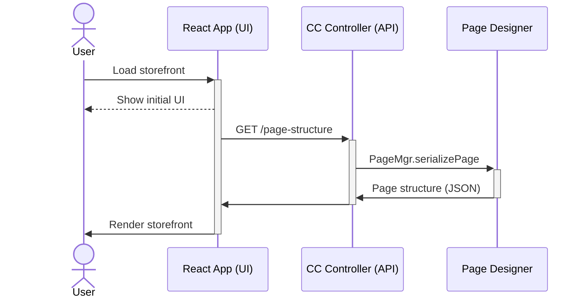

I've recently been involved in building some new things on
[Salesforce Commerce Cloud](https://www.salesforce.com/products/commerce-cloud/overview/) (SFCC), a
powerful enterprise e-commerce solution (think to Shopify, but Salesforce). Our goal
was to build a React front-end that makes use of as much of the Commerce Cloud platform and features
as possible. 

We looked to use it as a "headless" CMS, where SFCC is our content API, with our React app consuming
them and, in turn, rendering the right experience. This has the added benefit of reducing the 
ramp-up time for our engineers, as our front-end team and SFCC team can work through API contracts 
and don't need to worry about each other's internals and reduces the amount of SFCC knowledge our
front-end team needs to do their work.

Sadly this headless approach isn't something Commerce Cloud supports out-of-the-box. It seems to go
against a lot of their established patterns, but it is possible! There is a somewhat related PWA 
project called [pwa-kit](https://github.com/SalesforceCommerceCloud/pwa-kit) that uses SFCC, however
it doesn't have support for SFCC's WYSIWYG drag-and-drop page builder called "Page Designer", which
is a critical requirement for us, so we went our own way. 

_**A note:** Given the complex ecosystem and development that comes with SFCC sites, this post is not
going to be an in-depth tutorial for how to replicate this set-up. It is more of an overview that
hopes to provide you enough information to implement yourself._

Here is a sequence diagram showing, on a high level, our plan:



## Set-up

We started with getting our React app deployed onto the SFCC. We can do this by running a build
of our React application and once we have a `dist` directory, we can copy and upload its contents to
our SFCC cartridge under the `static` directory using VS Code and 
the [Prophet Debugger](https://marketplace.visualstudio.com/items?itemName=SqrTT.prophet) plugin. 
Our React app bundle ends up in a directory with a path looking something like the following:

```
[vs-code-project]/cartridges/custom_storefront_ui/cartridge/static/default/ui-app
```

The `ui-app` name here isn't special, a personal preference to keep the `static/default` 
directory organised. From this directory the files are available on the SFCC CDN and subject to 
their caching rules.

We then update our page template 
[`ISML`](https://documentation.b2c.commercecloud.salesforce.com/DOC1/index.jsp?topic=%2Fcom.demandware.dochelp%2Fcontent%2Fb2c_commerce%2Ftopics%2Fisml%2Fb2c_isml.html)[^1] 
file to use the scripts we uploaded to our `ui-app` directory. In the same cartridge as above, we 
add a series of `script` tags pointing to the main entry-points for our React app:

```html:title=custom_storefront_ui/cartridge/templates/default/experience/pages/main.isml
<iscontent charset="UTF-8" compact="true" type="text/html"/>
<isset name="locale" scope="page" value="${request.getLocale()}"/>

<!DOCTYPE html>
<html lang="${require('dw/util/Locale').getLocale(locale).getLanguage()}">
  <head>
      <meta name="viewport" content="width=device-width, initial-scale=1" />
      <link href="${URLUtils.staticURL('/ui-app/styles.css')}" rel="stylesheet"/>
  </head>
  <body>
    <div id="root"></div>
    <!-- START React scripts -->
    <script defer src="${URLUtils.absStatic('/ui-app/runtime.js')}" type="module"></script>
    <script defer src="${URLUtils.absStatic('/ui-app/polyfills.js')}" type="module"></script>
    <script defer src="${URLUtils.absStatic('/ui-app/vendor.js')}" type="module"></script>
    <script defer src="${URLUtils.absStatic('/ui-app/main.js')}" type="module"></script>
    <!-- END React scripts -->
  </body>
</html>

```
One thing to note here is the lack of `chunkhash` in the file names. Normally these files will have
a hash name in them (e.g. `runtime.e80b121e.js`), however we've disabled this in 
our [NX](https://nx.dev) (the react build) configuration so whenever we run a build, the four files
listed above do not include a hash. We do this to avoid needing to update this `main.isml` file 
after each React build with what would be the new hashed filenames. 

Viewing this page you should now see the React app in the browser. At the moment we haven't used any
SFCC content, our next goal is getting some content out of SFCC into our app.

## Supporting Page Designer

As I mentioned above, "Page Designer" is the drag-and-drop page editor that comes with Commerce 
Cloud, it allows business users to easily configure site pages, localise content and rearrange as 
needed. To use this feature with our headless approach we need a way to expose an API to provide the
page structure from Page Designer to our React application. The way we do this is through page
serialization.

### Serialize those pages (as JSON)

We can convert a page into a JSON tree by using the
[`PageMgr.serializePage`](https://documentation.b2c.commercecloud.salesforce.com/DOC1/index.jsp?topic=%2Fcom.demandware.dochelp%2FDWAPI%2Fscriptapi%2Fhtml%2Fapi%2Fclass_dw_experience_PageMgr.html&anchor=dw_experience_PageMgr_serializePage_String_String_DetailAnchor) 
function in a SFCC controller. With this you can serialize the page designer structure to a JSON 
object and return it as part of an API response, which will look something like the following:

```json:title=serializePage.example.json
{
  "id": "homepage",
  "type_id": "page",
  "data": {},
  "regions": [
    {
      "id": "body",
      "components": [
        {
          "id": "c8d423e964b01db4f4256f15cc",
          "type_id": "columns",
          "data": {},
          "regions": [
            {
              "id": "left",
              "components": [
                {
                  "id": "d535715a6ff1f0fe71e1eebed4",
                  "type_id": "commerce_assets.editorialRichText",
                  "data": {}
                }
              ]
            },
            {
              "id": "right",
              "components": [
                {
                  "id": "230e41aa858be42df3357510db",
                  "type_id": "myCustomComponent",
                  "data": {}
                }
              ]
            }
          ]
        }
      ]
    }
  ]
}
```
The above example shows a page template with a single region (id: `body`) and within that we have a
component called `columns` that itself also implements two more regions (`left` and `right`) with 
a component in each. The `type_id`'s for the components comes from the 
component definition JSON files, for custom components these are the JSON file names found in
this directory (these names will be important in a moment):

```
[vs-code-project]/cartridges/custom_storefront_ui/cartridge/experience/components/
```

For SFCC provided components, these use a reverse domain identifier, for example the rich text 
box's `type_id` will be: `commerce_assets.editorialRichText`.

### From JSON to React components

Now we have a JSON representation of our page that we can expose via an API in SFCC as a controller,
and our React app can make a `fetch` request for it. Now the big question is how can we turn that 
JSON object into React components?

Thanks to some previous work I have done with other
headless CMS providers, ([Contentful](https://www.contentful.com) and
[Prismic](https://prismic.io/)), there was a mapping pattern I could already make use of, which lets
us go from JSON structure to React components. 

This works by using a dictionary of possible components IDs that then a corresponding React 
component. Like so:

```js
import { MyRichTextComponent } from './components/MyRichTextComponent.jsx';
import { MyCustomComponent } from './components/MyCustomComponent.jsx';
import { MyBannerComponent } from './components/MyBannerComponent.jsx';

export const mapping = {
  'commerce_assets.editorialRichText': MyRichTextComponent,
  'textbox': MyCustomComponent,
  // [...] All the other components you have
}
```

Here we have a mapping object that contains keys that match each component's `type_id` from our JSON
page structure, with the value of that key is a React component. We then iterate over our JSON 
structure and do the following to render a component based on the `type_id`. 

We do this in what we call this our `PageBuilder` component. It accepts a JSON structure and then
iterates over the regions for that component and maps each `type_id` to our components as
defined in the `mapping`.

```tsx:title=PageBuilder.jsx
import { mapping } from './mapping.js';

export const PageBuilder = ({ regions }) => (
  <section>
    { regions.map((region) => {
      { region.components.map((component) => {
        const Component = mapping[component.type_id];
        return (<Component
          id={component.id}
          data={component.data}
          type_id={component.type_id}
          regions={component.regions || []} />
        )
      }) }
    }) }
  </section>
)
```

To keep the above example short-and-sweet this only iterates over the first level of regions. To 
support nested-regions (components that themselves have regions) you will need to do something 
recursive, or have the individual components include the `<PageBuilder />` component to render their
included regions.

## Future investigations

This approach is great for building rich and engaging user experiences in a common technology
from the industry it does come with its drawbacks.

A lot of the powerful front-end features of SFCC are exposed in their templating language ISML, 
which this approach does not make use of (we're using serialized json). An example is a lack of 
support for "content slots" which offers the ability to add targeted and/or scheduled content to a
page.

However, that doesn't mean it is not possible at all, and as these projects progress I will continue
to investigate how to add the "content slots" feature, and others, to make sure we can get the most
out of our SFCC project using React. 

I'll be posting follow-ups and more, as part of 
my [#sfcc-with-react](./posts/-/tags/sfcc-with-react) series.

[^1]: ISML is a custom templating syntax SFCC uses. 
[Read more in the docs](https://documentation.b2c.commercecloud.salesforce.com/DOC1/index.jsp?topic=%2Fcom.demandware.dochelp%2Fcontent%2Fb2c_commerce%2Ftopics%2Fisml%2Fb2c_isml.html)
