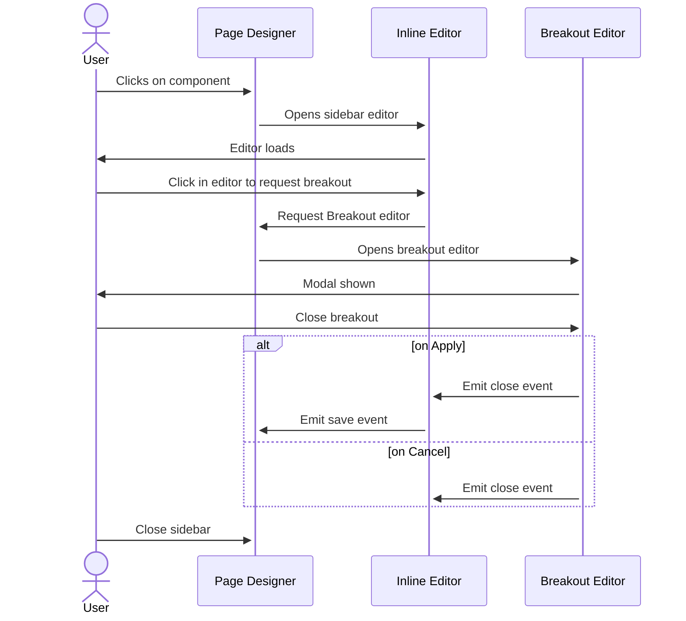

Salesforce Commerce Cloud offers a lot of data types and corresponding UI controls for their custom
attributes, but sometimes you need something different. Maybe a little extra validation or a
particular input UI to really make the user experience great.

This is where the Custom Attribute Editor feature really shines. These custom editors gives you fine
grain control over the UI input and behavior for a particular attribute, and even lets you save JSON
as an attribute value.

It does this by allowing you to build a custom form with HTML/CSS/Javascript to interact with a
particular attribute value via an iFrame embedded directly in the Page Designer interface. Normally
these Custom Attribute Editors are plain HTML/CSS/JS forms however there are some scenarios when it
may be beneficial to use a small React app to power these editor experiences.

We're going to break this guide down into a few sections and tackle each task one at a time:

1. Register a regular custom attribute editor
2. Add our React app
3. Expanding our app to support any number of editors
4. Adding support for breakout editors

As this post is quite long you can find a table of contents listed in the details component below:

<details>
<summary>Table of contents</summary>

{/* <!-- TOC --> */}
  * [Prerequisites](#prerequisites)
  * [1.0 - Register a plain custom attribute editor](#10---register-a-plain-custom-attribute-editor)
    * [1.1 - Create a new cartridge for our business manager extensions](#11---create-a-new-cartridge-for-our-business-manager-extensions)
    * [1.2 - Adding a debug component](#12---adding-a-debug-component)
    * [1.3 - Create our custom attribute editor definition files](#13---create-our-custom-attribute-editor-definition-files)
    * [1.4 - Custom editor client script](#14---custom-editor-client-script)
    * [1.5 - Talking to Page Designer](#15---talking-to-page-designer)
    * [1.6 - Review](#16---review)
  * [2.0 - Adding React to the mix](#20---adding-react-to-the-mix)
    * [2.1 - Required files](#21---required-files)
    * [2.2 - Basic SFCC events](#22---basic-sfcc-events)
  * [3.0 - One React App, many custom editors](#30---one-react-app-many-custom-editors)
    * [3.1 - Passing configuration into the app](#31---passing-configuration-into-the-app)
    * [3.1 - Add React Router](#31---add-react-router)
    * [3.2 - SFCC Event Client](#32---sfcc-event-client)
  * [4.0 - Adding support for breakout editors](#40---adding-support-for-breakout-editors)
    * [4.1 - Additional definition files to support breakout editors](#41---additional-definition-files-to-support-breakout-editors)
    * [4.2 - Client Updates for Breakout editor](#42---client-updates-for-breakout-editor)
    * [4.3 - Augmenting our React components to support breakout editors](#43---augmenting-our-react-components-to-support-breakout-editors)
    * [4.4 - Challenges using the same `customEditorClient.js` for both editors](#44---challenges-using-the-same-customeditorclientjs-for-both-editors)
  * [4.5 - A note about iFrame sandboxes](#45---a-note-about-iframe-sandboxes)
  * [5.0 - Resources](#50---resources)
{/* <!-- TOC --> */}

</details>

## Prerequisites

As usual this article expects you to have a basic understanding of web technologies and to have
familiarly with the Salesforce Commerce Cloud platform at a high level an on-demand sandbox (or
similar test environment) available with your IDE connected to it.

## 1.0 - Register a plain custom attribute editor

To get us started we are going to set up a regular (non-React) custom attribute editor as detailed
in the documentation
under [Develop a Custom Attribute Editor](https://documentation.b2c.commercecloud.salesforce.com/DOC1/index.jsp?topic=%2Fcom.demandware.dochelp%2Fcontent%2Fb2c_commerce%2Ftopics%2Fpage_designer%2Fb2c_custom_attr_editor.html).
First thing we are going to do is set up a new cartridge to keep our custom attribute editors and
any other to our business manager extensions we want to build.

### 1.1 - Create a new cartridge for our business manager extensions

This can be done using the Prophet debugger plugin for VSCode or by setting up the following
scaffold file in the following directory structure:

```
app_custom_bm_extensions
└─> cartridge
└─> app_custom_bm_extensions.properties
```

Inside the `app_custom_bm_extensions.properties` file we add the following:

```
## cartridge.properties for cartridge app_custom_bm
#Mon Apr 29 19:46:1 CEST 2023
demandware.cartridges.app_custom_bm_extensions.multipleLanguageStorefront=true
demandware.cartridges.app_custom_bm_extensions.id=app_custom_bm
```

One final step is to ensure this cartridge is added to your sites' Business Manager cartridge path
(not the site one). You can do this by going through `Administration > Sites > Manage Sites` and
under the heading "Business Manager Site" click the link that reads "Manage the Business Manager
site".

Now add your cartridge ID, for our example that is `app_custom_bm_extensions` to the cartridge path like you
would for the sites, separating with a `:`.

### 1.2 - Adding a debug component

Now we have a new cartridge start setting up a Page Designer component to test our attribute
editor with. We will add this new component to our existing pages to ensure the editor is working
correctly before using it on a regular component. This is not a requirement a more personal
preference to make development more reliable.

We're going to need two new files one (JSON and the other JS) added to our cartridge which together make up our component
definition. I am going to call our new component `Custom Attribute Editor`. First up lets create a
placeholder JS file and just add a comment for now:

```js:title=app_custom_bm_extensions/cartridge/cartridge/experience/components/customAttributeEditor.js
// Placeholder - No extra content at the moment.
```

Next up the component meta definition JSON file:

```json:title=app_custom_bm_extensions/cartridge/experience/components/customAttributeEditor.json
{
  "name": "Custom Attribute Editor",
  "description": "",
  "group": "Custom",
  "attribute_definition_groups": [
    {
      "id": "group1",
      "name": "An attribute group",
      "description": "",
      "attribute_definitions": [
        {
          "id": "playground",
          "name": "Playground",
          "type": "custom",
          "required": false,
          "editor_definition": {
            "type": "com.acme.customEditor",
            "configuration": {}
          }
        }
      ]
    }
  ],
  "region_definitions": []
}
```

With those two files created we've registered a new component that is requesting the
`com.acme.customEditor`custom editor. However, right now we've not registered it will appear as a
HTML `textarea` element as a fallback when viewed in Page Designer:


In the next step we will register our custom attribute editor with the platform which will replace
the fallback.

### 1.3 - Create our custom attribute editor definition files

Registering our custom editor requires two files, similar to the ones we created for our component,
a JS and a JSON file respectively, this time they need to be in a different location. Specifically
they need to be under `experience/editors` then additionally under a folder structure similar to
that of the reverse domain string we used above for the editor `type` so path would look like:

```
app_custom_bm_extensions/cartridge/experience/editors/com/acme/
```

First lets register our editor using a ["Custom Attribute Editor Meta Definition File"](https://documentation.b2c.commercecloud.salesforce.com/DOC1/topic/com.demandware.dochelp/content/b2c_commerce/topics/page_designer/b2c_custom_ui_cntrl_meta.html). Here we add
some supplementary information but most importantly we are adding a reference to our
(yet to be created) `customEditorClient.js` file.

```json:title=app_custom_bm_extensions/cartridge/experience/editors/com/acme/customEditor.json
{
  "name": "My Custom Editor (inline)",
  "description": "",
  "resources": {
    "scripts": [
      "/experience/editors/com/acme/customEditorClient.js"
    ],
    "styles": []
  }
}
```

With our meta definition file created lets move on to the Custom Attribute Editor script file. The
script file has the same name as the corresponding meta definition file but with a `.js` extension.
In the script file, you can optionally implement the init function to initialize the custom
attribute editor with server-side logic or resources. For now, we're just going to add a bit of
configuration to the editor:

```js:title=app_custom_bm_extensions/cartridge/experience/editors/com/acme/customEditor.js
'use strict';

var URLUtils = require('dw/web/URLUtils');
var PageMgr = require('dw/experience/PageMgr');
var HashMap = require('dw/util/HashMap');

/**
 * Init the ACME Custom Editor (inline)
 * @param editor
 *
 * @see https://documentation.b2c.commercecloud.salesforce.com/DOC1/topic/com.demandware.dochelp/content/b2c_commerce/topics/page_designer/b2c_custom_ui_cntrl_script.html
 */
module.exports.init = function (editor) {
  // This is important because it sets the asset URLs to the non-versioned URLs...
  editor.configuration.put('baseUrl', URLUtils.staticURL('/').https().toString());
};
```

### 1.4 - Custom editor client script

Our last step for Part 1 is to create the `customEditorClient.js` file we added to the resources
of our custom attribute editor definition JSON file. This file is the one added to the iFrame our
custom attribute editor is presented within when viewed in Page Designer. This iFrame is also where
lifecycle events are emitted to Page Designer in order to communicate interactions and updates to
the values.

__Note the change in file path here, this file needs to live in the `static` directory, not the
`experience` directories like our previous files.__

Typically, this is where we add an HTML form (via JavaScript) to edit our attribute and report back.
For now lets just use the basic scaffold to ensure everything is wired up:

```js:title=app_custom_bm_extensions/cartridge/static/default/experience/editors/com/acme/customEditorClient.js
() => {
  subscribe('sfcc:ready', async () => {
    console.log('sfcc:ready', dataLocale, displayLocale, value, config);
    let tempElement = document.createElement('h1');
    tempElement.innerText='Hello from customEditorClient.js';
    document.body.append(tempElement);
  });
};
```

### 1.5 - Talking to Page Designer

From the example above, we can see we're subscribed to the `sfcc:ready` event, and when that is
emitted the callback function is executed. This event is one of a series of "Custom Attribute Editor
Events". This series of events are used to communicate with Page Designer and instruct it to carry
out certain actions on our behalf:

| Event             | Description                                                                          |
|-------------------|--------------------------------------------------------------------------------------|
| `sfcc:interacted` | Indicates that the user has interacted with the custom attribute editor.             |
| `sfcc:valid`      | Indicates whether the value of the attribute is valid. Can include an error message. |
| `sfcc:value`      | The value of the attribute. Sent when the value changes inside the editor.           |

You can
find full information and examples for each of these in the SFCC documentation site
for ["Custom Attribute Editor Events"](https://documentation.b2c.commercecloud.salesforce.com/DOC1/topic/com.demandware.dochelp/content/b2c_commerce/topics/page_designer/b2c_host_events_custom_attr_editor.html).

We can transmit these events to Page Designer by using the `window.emit` function and will be using
them in a moment after we add our React app, however for now keep these in your back
pocket.

### 1.6 - Review

To quickly recap, we can now click on our `Custom Attribute Editor` component we added to Page
Designer we should see our custom attribute editor and in the place of a textarea component we saw
earlier we should now see a `<h1 />` saying `Hello from customEditorClient.js` and in the browser
console we should see the`"sfcc:ready"` message.


We should have the following files present in our `app_custom_bm_extensions` cartridge in the
appropriate directories:

```markdown
app_custom_bm_extensions
└─> cartridge
    ├─> experience
    │   ├─> components
    │   │   ├── customAttributeEditor.js
    │   │   └── customAttributeEditor.json
    │   └─> editors
    │       └─> com
    │           └─> editors
    │               └─> acme
    │                   ├── customEditor.js
    │                   └── customEditor.json
    └─> static
        └─> default
            └─> experience
                └─> com
                    └─> editors
                        └─> acme
                            └── customEditorClient.js
```

## 2.0 - Adding React to the mix

Now we have our plain custom attribute editor we can move on to replacing it with a React app! We
will assume you've got a React app ready to go for this, if not check out
the [create-react-app](https://create-react-app.dev/docs/getting-started) tutorial.

### 2.1 - Required files

First step is to ensure we're including the `dist` or build output from our React app in our
cartridge code. For this example we're going to upload the build using Prophet into a new directory
we're creating in `/static/default/`:

```bash
app_custom_bm_extensions/cartridge/static/default/apps/custom-editors/
```

If you're looking to keep the React app source code close to the cartridge code I would recommend
using something like [NX](https://nx.dev) to manage your mono-repo.

I use NX and one of the things I've setup for my NX build is disabled the usual cache busting hashes
present in the file names along with removing chunks. This leaves me with four JS files and one CSS
for the whole of my React app:

1. `vendor.js`
2. `polyfills.js`
3. `main.js`
4. `runtime.js`
5. `styles.css`

Now we have our `dist` files we can update the `cusotmEditorClient.js` code (the file SFCC initially
loads into our iFrame that we added in step 1.4) to inject our React app. We can do this by
replacing the JavaScript with the following:

```js:title=app_custom_bm_extensions/cartridge/static/default/experience/editors/com/acme/customEditorClient.js
(() => {
  /**
   * This file is what SFCC initially loads into the custom editor iFrame.
   * From here we inject our React bundle and, do some rudimentary data handling.
   *
   * @see https://documentation.b2c.commercecloud.salesforce.com/DOC1/topic/com.demandware.dochelp/content/b2c_commerce/topics/page_designer/b2c_host_events_custom_attr_editor.html
   */
  subscribe('sfcc:ready', async () => {

    // This is the path to the editor app's dist assets in our static/default directory.
    const EDITOR_APP_PATH = 'apps/custom-editors/';

    /**
     * Start our React injection logic.
     *
     * Essentialy we're mimicing what is normally in the index.html file of the dist, but
     * as we don't have any template we need to inject the scripts using JS.
     */

    // Create our React root element.
    const reactRoot = document.createElement('div');
    reactRoot.id = "root";
    document.body.appendChild(reactRoot);

    // React critical scripts
    const scripts = ['runtime', 'polyfills', 'vendor', 'main'];

    // Iterate over our predefined JS files and insert them one after the other.
    for (let i = 0; i < scripts.length; i++) {
      let scriptName = scripts[i];
      let reactScriptElm = document.createElement('script');
      reactScriptElm.setAttribute('type', 'text/javascript');
      reactScriptElm.setAttribute('src', config.baseUrl + EDITOR_APP_PATH + scriptName + '.js');
      document.head.appendChild(reactScriptElm);
    }

    // Insert our CSS to the iFrame <head />
    const reactStyles = document.createElement('link');
    reactStyles.setAttribute('rel', 'stylesheet');
    reactStyles.setAttribute('href', config.baseUrl + EDITOR_APP_PATH + 'styles.css');

    document.body.appendChild(reactStyles);
  });
})();
```

To recap, this file now sets up the React root element and then proceeds to dynamically insert the
four script tags into the custom attribute editor iFrame body along with a stylesheet which are our
required files for the React app. Our build files should be in the right places also:

```diff
   app_custom_bm_extensions
    └─> cartridge
        ├─> experience
        │   ├─> components
        │   │   ├── customAttributeEditor.js
        │   │   └── customAttributeEditor.json
        │   └─> editors
        │       └─> com
        │           └─> editors
        │               └─> acme
        │                   ├── customEditor.js
        │                   └── customEditor.json
        └─> static
            └─> default
+               ├─> apps
+               │   └─> custom-editors
+               │       ├── main.js
+               │       ├── polyfills.js
+               │       ├── runtime.js
+               │       ├── styles.css
+               |       ├── [...all the other React build output]
+               │       └── vendor.js
                └─> experience
                    └─> com
                        └─> editors
                            └─> acme
                                └── customEditorClient.js
```

Loading the Custom Attribute Editor now should look like the following if you're using the
quick-start React app or your own if you had a pre-built one:


Now we've got a React app embedded in Page Designer, now lets get them to talk to each other and
save a value provided in the app to Page Designer.

### 2.2 - Basic SFCC events

Let's add a button that saves the current date as a value to Page Designer and then
view that in the serialized page output. To my React app I am going to add a component that has a
simple button that when clicked, calls a handler function that calls the `window.emit` we discussed
earlier in Step 1.5:

```jsx:title=SimpleCustomAttributeEditorEvents.jsx
const SimpleCustomAttributeEditorEvents = () => {

  const handleOnClick = () => {
    window.emit({
      type: 'sfcc:value',
      payload: {
        newValue: new Date()
      }
    });
  }

  return (
    <div>
      <button onClick={() => handleOnClick()}>Test me</button>
    </div>
  )
}
```

After clicking the "Test me" button you'll notice the "Unpublish" button in the top right becomes
greyed out signifying there is an unsaved change on the page.


Then after clicking save in the bottom right of the sidebar, I see the confirmation alert pop-in and
the "Unpublish" button goes back to being enabled:


Viewing a JSON representation of the page via a controller
using [`PageMgr.serializePage()`](https://documentation.b2c.commercecloud.salesforce.com/DOC1/topic/com.demandware.dochelp/DWAPI/scriptapi/html/api/class_dw_experience_PageMgr.html#dw_experience_PageMgr_renderPage_String_String_DetailAnchor) we
can see the new value in the data:


Just like that we have a primitive custom attribute editor powered by a React app, which is awesome.
But wait, we can do a few other things to make this more scalable and useful.

## 3.0 - One React App, many custom editors

As things stand right now we've registered a single custom editor called `customEditor`, which we
can trigger by setting any component to use by setting the `editor_definition` property like so:

```json
 {
  "editor_definition": {
    "type": "com.acme.customEditor",
    "configuration": {}
  }
}
```

However, as we're injecting a React app here we can make this app multipurpose and use it for many
inputs, saving us the hassle and challenge of setting up a separate editor declaration for every
custom attribute editor experience we implement.

One way we can do this by using the `configration` property we set to `{}` earlier in our JSON:

```diff
  {
    "editor_definition": {
      "type": "com.acme.customEditor",
-     "configuration": {}
+     "configuration": {
+       "editorType": "playground"
+     }
    }
  }
```

This `configuration` proper gets passed to our `customEditorClient.js` as the `config` parameter
passed to our  in the `sfcc:ready` callback from [Step 1.4](#14---custom-editor-client-script)
above!

### 3.1 - Passing configuration into the app

Now we've got access to anything we've set on the component definition file we've got plenty of ways
we can pass this to the React app in the iFrame. One of the easiest ways and the way I like to do
this is to attach the configuration to a `window` global.

We can do this in the `customEditorClient.js` file by expanding what we added
in [1.4](#14---custom-editor-client-script):

```diff:title=app_custom_bm_extensions/cartridge/static/default/experience/editors/com/acme/customEditorClient.js
 (() => {
   /**
    * This file is what SFCC initially loads into the custom editor iFrame.
    * From here we inject our React bundle and, do some rudimentary data handling.
    *
    * @see https://documentation.b2c.commercecloud.salesforce.com/DOC1/topic/com.demandware.dochelp/content/b2c_commerce/topics/page_designer/b2c_host_events_custom_attr_editor.html
    */
-   subscribe('sfcc:ready', async () => {
+   subscribe('sfcc:ready', async ({ value, config, isDisabled, isRequired, dataLocale, displayLocale }) => {

+    /**
+     * Attach the existing value (if available) for the component and some other
+     * data for the React app to consume later.
+     */
+    window.amce = {
+      originalValue: value,
+      config,
+      isDisabled,
+      isRequired,
+      dataLocale,
+      displayLocale,
+    }
+
     // This is the path to the editor app's dist assets in our static/default directory.
     const EDITOR_APP_PATH = 'apps/custom-editors/';

     /**
      * Start our React injection logic.
      *
      * Essentialy we're mimicing what is normally in the index.html file of the dist, but
      * as we don't have any template we need to inject the scripts using JS.
      */

     // Create our React root element.
     var reactRoot = document.createElement('div');
     reactRoot.id = "root";
     document.body.appendChild(reactRoot);

     // React critical scripts
     var scripts = ['runtime', 'polyfills', 'vendor', 'main'];

     // Iterate over our predefined JS files and insert them one after the other.
     for (var i = 0; i < scripts.length; i++) {
       var scriptName = scripts[i];
       var reactScriptElm = document.createElement('script');
       reactScriptElm.setAttribute('type', 'text/javascript');
       reactScriptElm.setAttribute('src', config.baseUrl + EDITOR_APP_PATH + scriptName + '.js');
       document.head.appendChild(reactScriptElm);
     }

     var reactStyles = document.createElement('link');
     reactStyles.setAttribute('rel', 'stylesheet');
     reactStyles.setAttribute('href', config.baseUrl + EDITOR_APP_PATH + 'styles.css');

     document.body.appendChild(reactStyles);
   });
 })();
```

From here you can handle the React app however you see fit. The following part will showcase how I
use React Router to handle multiple editors but if you want to skip ahead the next implementation
agnostic section is [Part 3.2](#32---sfcc-event-client) where we look at a "client" for the various
Page Designer events we can support.

### 3.1 - Add React Router

Inside my `App.jsx` file I set up a basic router to navigate to various routes based on the
`config.editorType` property we set in the component definition JSON file. For example:

```jsx:title=App.jsx
import { Navigate, Route, Routes, useLocation } from "react-router-dom";

export function App() {

  const location = useLocation();
  const definition = window.acme;
  const requestedRoute = '/editor/' + definition.editorType;

  if (!definition || !requestedRoute) {
    return <ErrorPage message={'Missing editor/page configuration'} />;
  }

  if (requestedRoute && requestedRoute !== location.pathname) {
    return <Navigate to={requestedRoute} />;
  }

  return (
    <Routes>
      <Route path={'/'} element={<HomePage />} />
      <Route path={'/editor/:editorId'} element={<EditorComponent definition={definition} />} />
      <Route path={'*'} element={<ErrorPage message={'Page not found'} />} />
    </Routes>
  )
}
```

With the above component, we're first checking we've got a `editorType` property on the config and
redirecting to the page as required on initial load, we're then deferring to our
`<EditorComponent />` component to handle the rendering of the specific editor.

In the `EditorComponent` we use a mapping pattern to dynamically map components to their
`editorType` names:

```jsx
// Set up a map of editorTypes string to a specific component.
const availableEditors = {
  'example': ExampleEditor,
}

export const EditorWrapper = ({ definition }) => {

  // Grabs the editorType from the URL parameters we set in App.jsx
  const { editorType } = useParams();

  // Grab the config from our definition.
  const { config } = definition;

  // Presense checks
  if(!editorType || !availableEditors[editorType]) {
    return (
      <FourOhFourPage
        message={`
          Unsupported editor requested with id: "${editorType}". Please check the
          [component].json file to be one of our supported editors.
        `}
      />
    );
  }

  // Map to component
  const EditorComponent = availableEditors[editorType];

  return (
      <EditorComponent config={config} />
  )
}
```

Build and deploy to your sandbox, and we now have a way to dynamically change the React app that is
rendered based on the value configured in the component definition JSON!

### 3.2 - SFCC Event Client

As we briefly mentioned above and in [Part 1.5](#15---talking-to-page-designer), there are a series
of Custom Attribute Editor Events we can use to communicate between Page Designer and our custom
attribute editor. Now we support any number of editors in a single application it is probably a good
idea to standardize the communication between the editor and Page Designer to avoid repeating the
various `window.emit` calls we will be making.

To do this I like to build out an "SFCC Editor Client" of sorts. A simple JS library that
facilitates communication between our React app and Page Designer. Into your React app copy the
following JavaScript into a library/script directory:

```js
/**
 * Events Emitted by the Custom Attribute Editor
 *
 * The vendor specified event names for the various events we emit to
 * Page Designer.
 *
 * @see https://documentation.b2c.commercecloud.salesforce.com/DOC1/index.jsp?topic=%2Fcom.demandware.dochelp%2Fcontent%2Fb2c_commerce%2Ftopics%2Fpage_designer%2Fb2c_custom_attr_editor.html&cp=0_7_7_4
 */
export const SFCC_EVENT_TYPES = {
  EDITOR_INTERACTED: 'sfcc:interacted',
  VALUE_VALID: 'sfcc:valid',
  VALUE_APPLY: 'sfcc:value'
}

/**
 * Communicate updates to Page Designer
 *
 * @param {Object} newValue - The new/existing data value for this attribute.
 * @param {boolean} [isValid=true] - Update the current validity state of the attribute in Page Designer.
 * @param {String} validityMessage - (Optional) A message to pass to Page Designer that will render as the error message.
 */
export const handleChangeEvent = (newValue, isValid = true, validityMessage) => {
  handleInteraction();
  handleValidity(isValid, validityMessage);
  if (isValid) {
    handleUpdate(newValue);
  }
};

/**
 * Indicates that the user has interacted with the custom attribute editor. The editor is implicitly
 * marked as interacted when it is blurred, for example, when the editor's contentWindow loses
 * focus. Page Designer supports an interacted (or touched) state for form elements.
 * This state marks a field that a user already interacted with, for example, by tabbing through it.
 * Being able to mark a field as touched allows for error messages in forms to be hidden initially
 * and only display for fields with which a user has interacted.
 */
const handleInteraction = () => {
  window.emit({
    type: SFCC_EVENT_TYPES.EDITOR_INTERACTED
  });
};

/**
 * Indicates whether the value of the attribute is valid. Can include an error message.
 *
 * @param {boolean} validity - If the field is valid or not
 * @param {string} message - The error message passed to override the default
 */
const handleValidity = (validity, message) => {
  window.emit({
    type: SFCC_EVENT_TYPES.VALUE_VALID,
    payload: {
      valid: validity,
      message: message
    }
  });
};

/**
 * The value of the attribute. Sent when the value changes inside the editor.
 * Page Designer requires that the value be a plain JavaScript object.
 *
 * Please note: This event will mark the sidebar as having changed, clicking save
 * on the sidebar will trigger a rerender of the editor.
 *
 * @param {object} newValue - The new value to be passed to SFCC.
 */
const handleUpdate = (newValue) => {
  window.emit({
    type: SFCC_EVENT_TYPES.VALUE_APPLY,
    payload: newValue
  });
};
```

You'll see of the three different events we mentioned earlier that you can emit from an editor we've
combined them into a single `handleChangeEvent` function that we can use in our components to
communicate all changes with. The rest of the file is more scaffolding and ensuring the
`handleChangeEvent` does what we need it to.

We can emit a change event by calling `handleChange` passing our current data or state, followed by
a boolean flag for the validity state that (in this example) defaults to `true`, following by an
optional message to display in the UI. For example, we can refactor our previous simple example from
[Step 2.2](#22---basic-sfcc-events) to use the client like so:

```jsx:title=SimpleCustomAttributeEditorEvents.jsx
import { handleChangeEvent } from "../lib/custom-attribute-editor-client";

const SimpleCustomAttributeEditorEvents = () => {

  const handleOnClick = () => {
    handleChangeEvent({
      newValue: new Date()
    });
  }

  return (
    <div>
      <button onClick={() => handleOnClick()}>Test me</button>
    </div>
  )
}
```

## 4.0 - Adding support for breakout editors

A breakout editor is the SFCC term for an editor that appears in a Page Designer managed modal. The
editor "breaks out" of the sidebar and takes over the entire screen. This is a great solution for
complex user experiences where you need that additional screen real-estate to craft the data we're
storing in Page Designer.

_**Note**: this is an optional addition to a custom attribute editor, you do not need to add support for
breakout editors if it doesn't work for your use case._


Before we dive in to how we can implement this I want to mention how the management of breakout
editors work. First the editor in the sidebar (what I refer to as the inline editor) opens, from
that editor, we emit a new event type requesting a breakout editor. Page Designer receives that
event and handles the modal presentment. The communication between the breakout editor and page
designer is routed through the sidebar editor.


<details>
<summary>Sequence Diagram</summary>



</details>

With that said lets get started adding support for breakout editors.

### 4.1 - Additional definition files to support breakout editors

Like we did for our custom editors back
in [Step 1.3](#13---create-our-custom-attribute-editor-definition-files) we need to add some other
editor definition files. Let's start with adding two new files to
our `/cartridge/experience/editors/com/acme/` directory:

1. `customEditorBreakout.js`
2. `customEditorBreakout.json`

Let's start by setting up the server-side JS file part of the definition with content that is
identical to our previous attribute editor file:

```js:title=customEditorBreakout.js
'use strict';

var URLUtils = require('dw/web/URLUtils');

/**
 * ACME Custom Editor (breakout)
 * @param editor
 *
 * @see https://documentation.b2c.commercecloud.salesforce.com/DOC1/index.jsp?topic=%2Fcom.demandware.dochelp%2Fcontent%2Fb2c_commerce%2Ftopics%2Fpage_designer%2Fb2c_custom_attr_editor.html&cp=0_7_7_4
 */
module.exports.init = function (editor) {
  // This is important because it sets the asset URLs to the non-versioned URLs...
  editor.configuration.put('baseUrl', URLUtils.staticURL('/').https().toString());
};
```

And same again with the JSON file, again with identical content:

```json:title=customEditorBreakout.json
{
  "name": "ACME Custom Editor (breakout)",
  "description": "Wrapper editor around our reusable React editor app.",
  "resources": {
    "scripts": [
      "/experience/editors/com/acme/customEditorClient.js"
    ],
    "styles": []
  }
}
```

Note how we're using the same `customEditorClient.js` in both the `customEditorBreakout.json` and
`customEditor.json` files. This is deliberate as we want the same React app to be mounted in both
our "inline" and "breakout" editors. We need to make the following additions to our
original `customEditor.js` file also:

```diff:title=/cartridge/experience/editors/com/acme/customEditor.js
 'use strict';

 var URLUtils = require('dw/web/URLUtils');
 var PageMgr = require('dw/experience/PageMgr');
 var HashMap = require('dw/util/HashMap');

 /**
  * Init the ACME Custom Editor (inline)
  * @param editor

  * @see https://documentation.b2c.commercecloud.salesforce.com/DOC1/index.jsp?topic=%2Fcom.demandware.dochelp%2Fcontent%2Fb2c_commerce%2Ftopics%2Fpage_designer%2Fb2c_custom_attr_editor.html&cp=0_7_7_4
  */
 module.exports.init = function (editor) {
+  // Create a reference to the breakout custom editor
+  var breakoutEditor = PageMgr.getCustomEditor('com.acme.customEditorBreakout', new HashMap());

   // This is important because it sets the asset URLs to the non-versioned URLs...
   editor.configuration.put('baseUrl', URLUtils.staticURL('/').https().toString());

+  // Add a dependency to the configured breakout editor
+  editor.dependencies.put('customEditorBreakout', breakoutEditor);
 };
```

With that the definition files are updated, last step is to update the Page Designer client we
set up during [Step 3.2](#32---sfcc-event-client) to ensure the breakout editor can work which we
will look at next.

### 4.2 - Client Updates for Breakout editor

When adding breakout editor support we add support for three new event types we didn't add earlier.
These are the `open`, `apply`, and `cancel` which do the following:

- Open requests Page Designer to open the specified editor in a modal
- Apply which closes the breakout editor and apply the changes made in the breakout editor to
the _inline editor_.
- Cancel which closes the breakout editor and discard the changes made in the breakout editor.

Taking what we added to the file we set up in [Step 3.2](#32---sfcc-event-client) we can expand our
client to use these new breakout methods like so:

```diff
 /**
  * Events Emitted by the Custom Attribute Editor
  *
  * The vendor specified event names for the various events we emit to
  * Page Designer.
  *
  * @see https://documentation.b2c.commercecloud.salesforce.com/DOC1/index.jsp?topic=%2Fcom.demandware.dochelp%2Fcontent%2Fb2c_commerce%2Ftopics%2Fpage_designer%2Fb2c_custom_attr_editor.html&cp=0_7_7_4
  */
 export const SFCC_EVENT_TYPES = {
+  BREAKOUT_OPEN: 'sfcc:breakout',
+  BREAKOUT_APPLY: 'sfcc:breakoutApply',
+  BREAKOUT_CANCEL: 'sfcc:breakoutCancel',
   EDITOR_INTERACTED: 'sfcc:interacted',
   VALUE_VALID: 'sfcc:valid',
   VALUE_APPLY: 'sfcc:value'
 }

+/**
+ * BREAKOUT EDITOR
+ *
+ * This is the editor name as defined in the editor_definition files
+ * in the `app_custom_bm_extensions` cartridge.
+ *
+ * This value should match the breakout editor file name(s).
+ *
+ * @see cartridges/app_custom_bm_extensions/cartridge/experience/editors/com/acme/customEditorBreakout.js
+ */
+const SFCC_CUSTOM_EDITOR_KEY = 'customEditorBreakout';
+
+/* LocalStorage key for breakout editors */
+export const BREAKOUT_EDITOR_STORAGE_KEY = 'acme-breakout-editor-type';

 /**
  * Communicate updates to Page Designer
  *
  * @param {Object} newValue - The new/existing data value for this attribute.
  * @param {boolean} [isValid=true] - Update the current validity state of the attribute in Page Designer.
  * @param {String} validityMessage - (Optional) A message to pass to Page Designer that will render as the error message.
  */
 export const handleChangeEvent = (newValue, isValid = true, validityMessage) => {
   handleInteraction();
   handleValidity(isValid, validityMessage);
   handleUpdate(newValue);
 };

 /**
  * Indicates that the user has interacted with the custom attribute editor. The editor is implicitly
  * marked as interacted when it is blurred, for example, when the editor's contentWindow loses
  * focus. Page Designer supports an interacted (or touched) state for form elements.
  * This state marks a field that a user already interacted with, for example, by tabbing through it.
  * Being able to mark a field as touched allows for error messages in forms to be hidden initially
  * and only display for fields with which a user has interacted.
  */
 const handleInteraction = () => {
   window.emit({
     type: SFCC_EVENT_TYPES.EDITOR_INTERACTED
   });
 };

+/**
+ * Trigger a breakout event for the editor app.
+ *
+ * @see https://documentation.b2c.commercecloud.salesforce.com/DOC1/topic/com.demandware.dochelp/content/b2c_commerce/topics/page_designer/b2c_client_side_breakout_cae.html?resultof=%22%62%72%65%61%6b%6f%75%74%22%20
+ */
+export const handleBreakoutRequest = (title, editorType, onApply, onCancel) => {
+
+  // Before we trigger the breakout we need to set a localstorage value to
+  // communicate which editor it should be displaying in the pop-up.
+  window.localStorage.setItem(BREAKOUT_EDITOR_STORAGE_KEY, editorType);
+
+  const breakoutCloseCallback = ({ type, value }) => {
+    if (type === SFCC_EVENT_TYPES.BREAKOUT_APPLY) {
+      console.log(`Breakout editor "${editorType}" has been closed with: APPLY.`);
+      window.emit({
+        type: SFCC_EVENT_TYPES.VALUE_APPLY,
+        payload: value
+      });
+      if (onApply) {
+        onApply(value);
+      }
+    } else {
+      console.log(`Breakout editor "${editorType}" has been closed with: CANCEL/CLOSE.`);
+      if (onCancel) {
+        onCancel();
+      }
+    }
+    window.localStorage.removeItem(BREAKOUT_EDITOR_STORAGE_KEY);
+  }
+
+  // Begin the SFCC window.emit call to tell Page Designer to open the Breakout
+  // Editor
+  window.emit({
+    type: SFCC_EVENT_TYPES.BREAKOUT_OPEN,
+    payload: {
+      id: SFCC_CUSTOM_EDITOR_KEY,
+      title: title
+    }
+  }, breakoutCloseCallback);
+
+
+};

 /**
  * Indicates whether the value of the attribute is valid. Can include an error message.
  *
  * @param {boolean} validity - If the field is valid or not
  * @param {string} message - The error message passed to override the default
  */
 const handleValidity = (validity, message) => {
   window.emit({
     type: SFCC_EVENT_TYPES.VALUE_VALID,
     payload: {
       valid: validity,
       message: message
     }
   });
 };

 /**
  * The value of the attribute. Sent when the value changes inside the editor.
  * Page Designer requires that the value be a plain JavaScript object.
  *
  * Please note: This event will mark the sidebar as having changed, clicking save
  * on the sidebar will trigger a rerender of the editor.
  *
  * @param {object} newValue - The new value to be passed to SFCC.
  */
 const handleUpdate = (newValue) => {
   window.emit({
     type: SFCC_EVENT_TYPES.VALUE_APPLY,
     payload: newValue
   });
 };
```

That was a lot of code but, we've added client functionality for our three new event types, and we've
added a new `handleBreakoutRequest` method to abstract the behavior to make opening breakout editors
easier for any number of editors.

We use a `localStorage` key to keep a reference to an open breakout editor, as in theory you could
have more than one Custom Attribute Editor active at any one time for a single component in Page
Designer, this ensures we can keep track of which editor should be presented in the breakout editor.

### 4.3 - Augmenting our React components to support breakout editors

With our client updated we can make some minor adjustments to our React components to trigger a
breakout editor. As this changes the viewport of an application from a narrow sidebar to a larger
modal I would recommend taking care when designing your components to maximise this additional
screen space.

For my set-up I wrap my editors in a generic component like so with the definition being our config
object being passed from the component definition, predominantly being the `editorId`, and as a
reminder the `defintiion` we're passing here is simply a reference to the `window.acme` object we
set up back in [Step 3.1](#31---passing-configuration-into-the-app).

```jsx
export const EditorWrapper = ({definition}) => {

  const {editorId} = useParams();

  const {config} = definition;

  if (!editorId || !availableEditors[editorId]) {
    return <ErrorPage />
  }

  const EditorComponent = availableEditors[editorId];
  const isBreakoutEditor = !config.editorType;

  return (
    <EditorComponent
      isBreakoutEditor={isBreakoutEditor}
      editorType={config.editorType}
      onChange={handleChangeEvent} // Our API client method
      onTriggerBreakoutEditor={handleBreakoutRequest}
      originalValue={definition.originalValue}
      {...config}
    />
  )
}
```

Doing this allows me to have a standard set of I/O for my editors and easily trigger breakout
editors and save events as required.

### 4.4 - Challenges using the same `customEditorClient.js` for both editors

As we're using the same `customEditorClient.js` for both our inline and breakout editors there is an
unfortunate issue we need to work-around when it comes to the `editorType` configuration. Typically,
we extract that property from the `config` argument from the `sfcc:ready` callback. For our inline
editor, this is defined and available, for breakout editors it is not.

We can use localStorage as a workaround for this, below is a simplified example to explain
how, we use localStorage to get around this missing `config`. When we trigger a breakout editor to
open we set the ID of the editor requesting the breakout to a localStorage entry, which is then read
during the initial set up:

```tsx
// Grab the window object we set in customEditorClient.js.
const definition = window.acme;

// The inline scenario this value will be what we add to our component editor config
// The breakout scenario this is undefined.
let requestedRoute = definition.route;

// Check to see if we have a value in LocalStorage.
const editorTypeFromStorage = window.localStorage.getItem('example-ls-key');

// If the route is undefined AND we have a localstorage key, we're probably in breakout mode.
if(requestedRoute === '/editor/undefined' && editorTypeFromStorage) {
  requestedRoute = `/editor/${editorTypeFromStorage}`;
}
```

During the `breakoutCloseCallback` we added as part of our client above, we then remove the
`localStorage` key.

## 4.5 - A note about iFrame sandboxes

Your custom attribute editor will be added via an iFrame that has both the `allow-scripts` and the
`allow-same-origin` sandbox attributes. Without the `allow-forms` using forms funnily enough doesn't
work, even things like `react-hook-form`'s example makes use of the `<form onSubmit={() => {}} />`
and without the `allow-forms` sandbox rule, the iFrame stops any forms submitting.

The best way around this is to adjust the react-hook-form example to the following and note the
handle submit on a normal, non-submit type button:

```tsx
<form>
  {/* register your input into the hook by invoking the "register" function */}
  <input defaultValue="test" {...register("example")} />

  {/* include validation with required or other standard HTML validation rules */}
  <input {...register("exampleRequired", { required: true })} />
  {/* errors will return when field validation fails  */}
  {errors.exampleRequired && <span>This field is required</span>}

  <button onClick={handleSubmit(onSubmit, onError)}>Submit</button>
</form>
```

## 5.0 - Resources

- [Component Attribute Types and UI Controls](https://documentation.b2c.commercecloud.salesforce.com/DOC1/index.jsp?topic=%2Fcom.demandware.dochelp%2Fcontent%2Fb2c_commerce%2Ftopics%2Fpage_designer%2Fb2c_comp_attr_types.html&resultof=%22%65%6e%75%6d%22%20) (Salesforce B2C Commerce Docs - accessed June 25, 2023).
- [Develop a Custom Attribute Editor](https://documentation.b2c.commercecloud.salesforce.com/DOC1/topic/com.demandware.dochelp/content/b2c_commerce/topics/page_designer/b2c_custom_attr_editor.html) (Salesforce B2C Commerce Docs - accessed June 25, 2023).
- ["Creating a Breakout Custom Attribute Editor in Page Designer for Salesforce Commerce Cloud"](https://beeit.io/blog/creating-a-breakout-custom-attribute-editor-in-page-designer-for-salesforce-commerce-cloud-sfcc) - a post from Bee IT which helped me in my background reading for this post. 
